## native ui tools + custom ui tools
    

This app gives the assistant access to four types of tool calls:
1) Native Tools — e.g pulling data
2) Native UI elements — built-in Chainlit only (e.g. cl.Plotly, cl.Pdf, cl.Action, cl.AskUserMessage, …). See list below.
3) Custom UI elements — tool calls to add cl.CustomElement + JSX (e.g. DynamicForm, GanttTimeline, etc.). User input flows back to the assistant and thread history.
4) Custom UI on the fly — builds new JSX in-session as needed based off the conversation. 
    

```
# Requires: Python <3.14.0, >=3.10 and chainlit 2.11.1

git clone https://gitlab.us.lmco.com/e321843/agentic-ui
cd agentic-ui

python3.13 -m venv venv  
source venv/bin/activate

pip install .chainlit/chainlit-2.11.1-py3-none-any.whl 
pip install -r requirements.txt 

chainlit --version

cp .env.example .env

chainlit run app.py -w 
```

## Custom UI on the fly - tool call to generate any JSX
<table>
  <tr>
    <td align="center">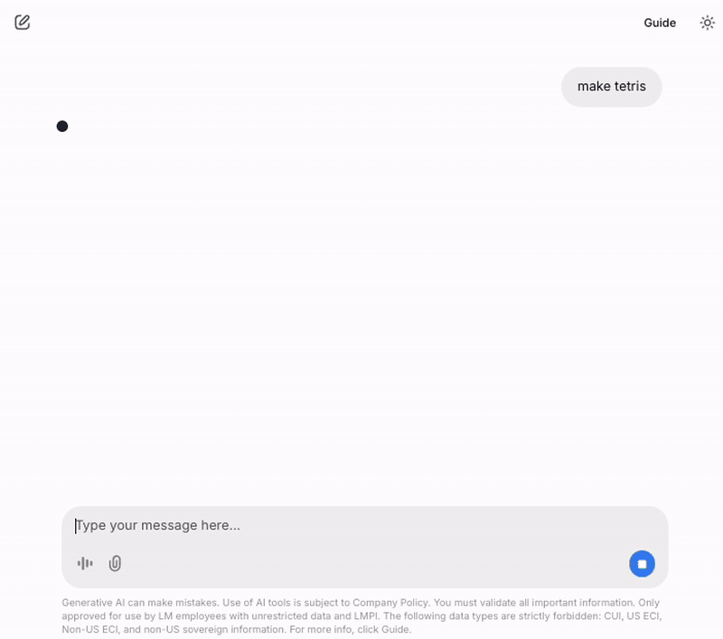</td>
    <td align="center">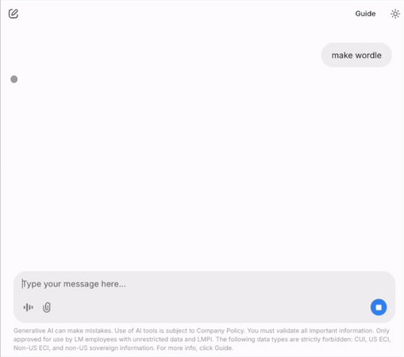</td>
  </tr>
</table>

## Custom UI (tool call to any JSX elements you create)
<table>
  <tr>
    <td align="center">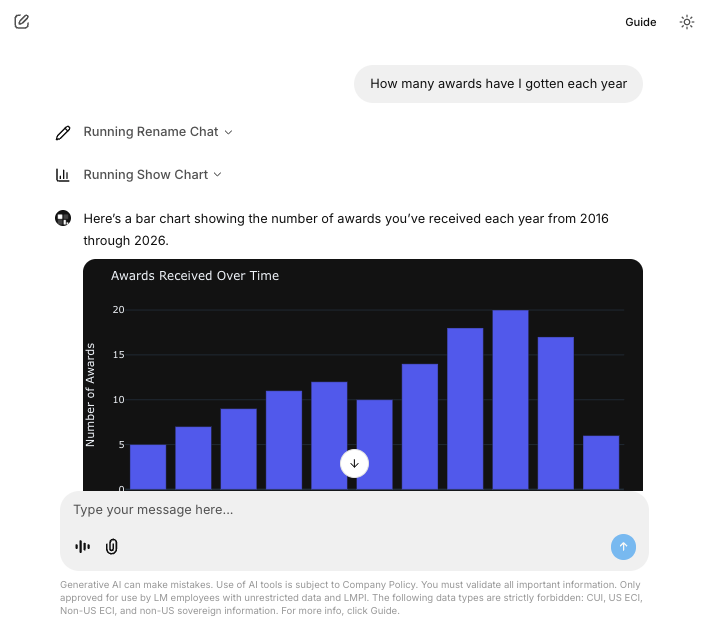</td>
    <td align="center">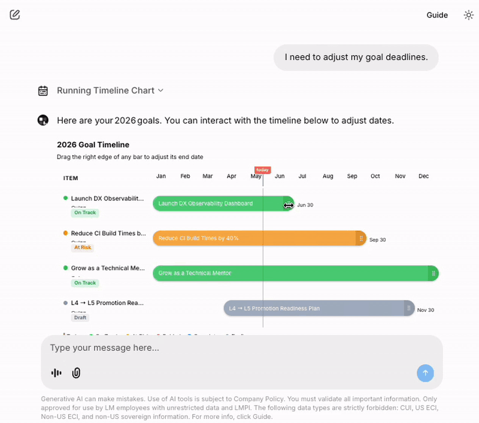</td>
    <td align="center">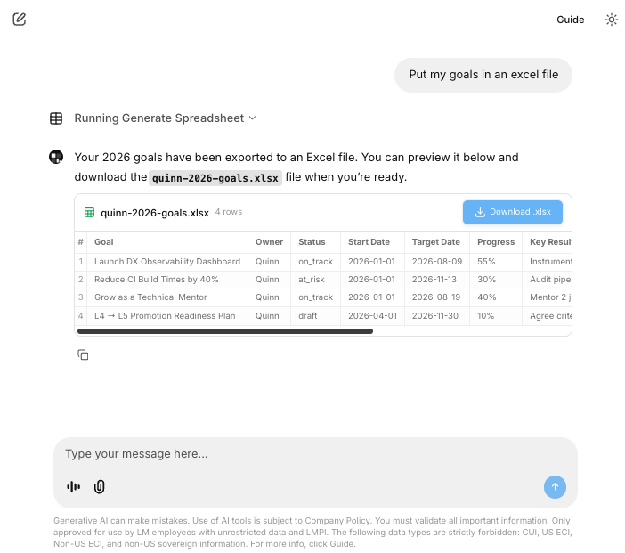</td>
  </tr>
  <tr>
      <td align="center">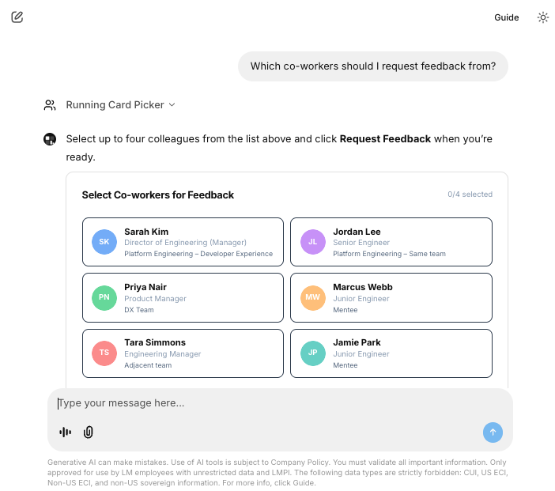</td>
          <td align="center">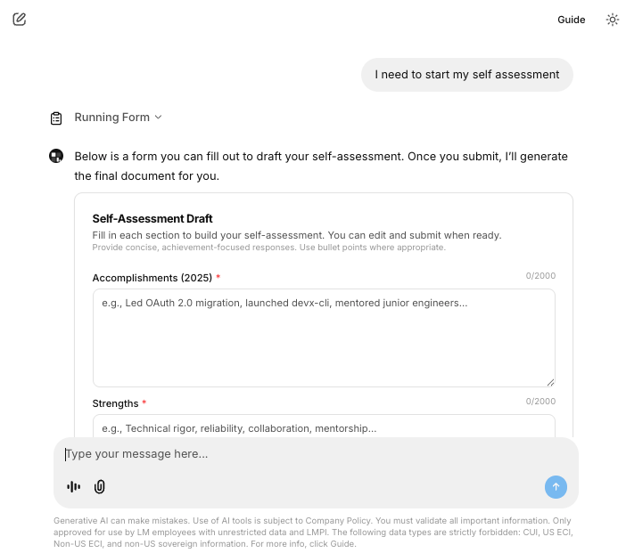</td>
    <td align="center">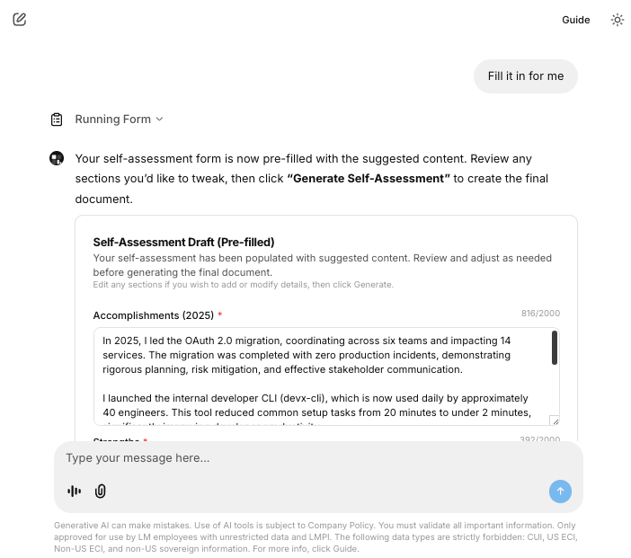</td>
  </tr>
  <tr>
    <td align="center">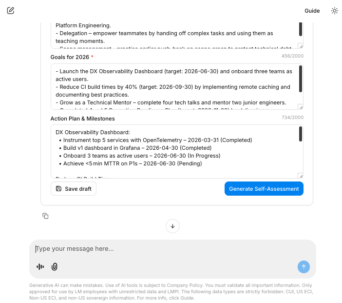</td>
    <td align="center">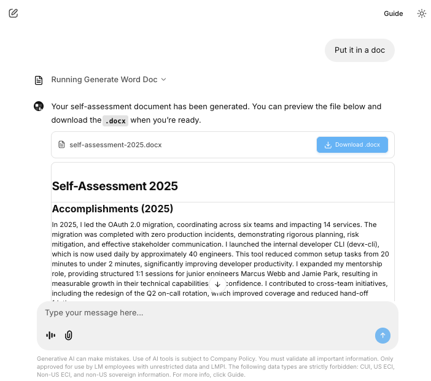</td>
    <td align="center">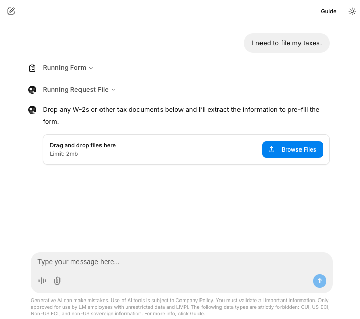</td>
  </tr>
<table>

## Native UI element tool calls (built-in Chainlit)
```
cl.Action
cl.Dataframe
cl.Plotly
cl.Pyplot
cl.Pdf
cl.File
cl.Text
cl.CustomElement
cl.TaskList
cl.AskUserMessage
cl.AskFileMessage
cl.AskActionMessage
cl.AskElementMessage
cl.Task
cl.TaskStatus
```

## Test all
THe UI tool calls are given to the assistant / llm client as optional tools to use throughout the conversation. 
To run / test all at once, enter "test" in the chat. 

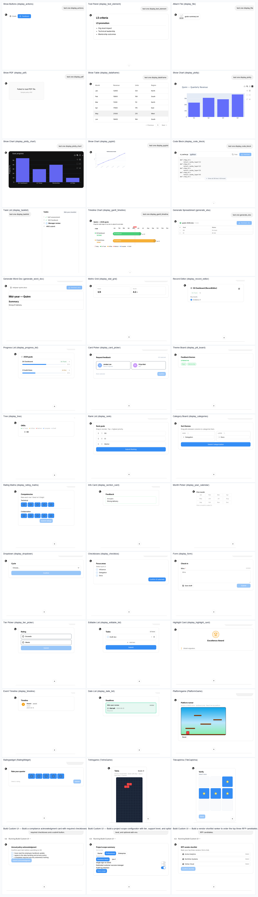


---
### Adding new custom JSX elements as UI tool calls

For custom jsx elements, use Tailwind for styling.  
For imports, these are the only allowed imports: 
```
react
sonner
zod
recoil
react-hook-form
lucide-react
@/components/ui/accordion
@/components/ui/aspect-ratio
@/components/ui/avatar
@/components/ui/badge
@/components/ui/button
@/components/ui/card
@/components/ui/carousel
@/components/ui/checkbox
@/components/ui/command
@/components/ui/dialog
@/components/ui/dropdown-menu
@/components/ui/form
@/components/ui/hover-card
@/components/ui/input
@/components/ui/label
@/components/ui/pagination
@/components/ui/popover
@/components/ui/progress
@/components/ui/scroll-area
@/components/ui/separator
@/components/ui/select
@/components/ui/sheet
@/components/ui/skeleton
@/components/ui/switch
@/components/ui/table
@/components/ui/textarea
@/components/ui/tooltip
```
The @/components/ui imports are from Shadcn.
