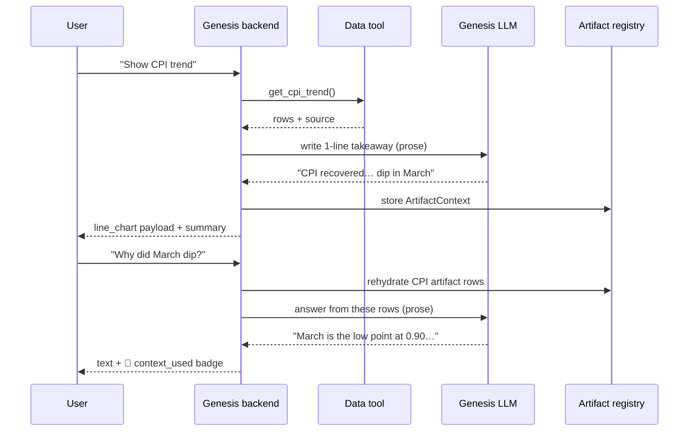

# 10. Using the Internal Genesis LLM (zero → working)

This is the **only LLM backend**. Genesis is an OpenAI-compatible **Completions** API
(`POST /completions` with `{model, prompt}`), reached at `https://api.ai.us.lmco.com/v1`
with a bearer `LLM_API_KEY` and `LLM_MODEL` (e.g. `openai/gpt-oss-120b`). It does not
change the contracts: Genesis drives the **same** `AgentUIPayload` + `ArtifactContext`,
rendered by the **same** `<AgentUIRenderer>`.

## The hybrid design (why the demo is reliable)

`gpt-oss-120b` is a **reasoning model**: asked for strict JSON it tends to "think out loud"
first, so a pure model-emits-JSON loop is flaky (it rendered ~1 of 5 prompts in live
testing). We split the work along the model's strengths:

| Concern | Owner | Why |
| --- | --- | --- |
| **Structure** — which data tool, which component, field mapping | **deterministic router** ([`agent/genesis_agent.py`](../agent/genesis_agent.py)) | guarantees the *right* chart + data every time; the model can't break it |
| **Numbers** | **data tools** ([`agent/data_tools.py`](../agent/data_tools.py)) | the model never fabricates data |
| **Prose** — the takeaway sentence + follow-up answers | **the Genesis LLM** | natural language is exactly what a reasoning model is good at |

If the model returns reasoning junk (or you're offline in mock mode), the prose falls back
to a deterministic sentence — so the user **never** sees an empty or broken reply. That's
why all canned prompts and follow-ups work whether or not the live API behaves perfectly.

> This replaced the earlier pure-JSON approach documented in `session-changes.md` (which
> hit the reasoning-leak / "?" / silent-failure issues). Those are resolved by the hybrid
> split above.

## Zero → working in one command (no key needed)

Every example runs offline with a built-in mock client, so a developer can see the whole
pipeline before they have credentials:

```bash
# CLI: the full canonical conversation, printing validated payloads + artifacts
python3 scripts/genesis_demo.py --mock

# In the browser:
python3 -m pip install -r agent/requirements.txt
npm install
npm run dev:genesis      # starts the Genesis backend (mock) + Vite
# open http://localhost:5173/  → chat on the left, context/payload/gallery on the right
```

`/api/health` returns `{"mode":"mock"}` until you add a key.

## Demo walkthrough — what each canned prompt proves

Click the chips on the left in this order. The right-hand panel (Context / Payload /
Gallery) is the "show the developer how it works" half.

| Click | What renders (left) | What it proves | Where to look (right) |
| --- | --- | --- | --- |
| **Show CPI trend…** | line chart | the agent turns a question into the *right* visual (GOAL 1) | **Payload** tab = the exact `AgentUIPayload`; **Context** gains 1 card |
| **Why did March dip?** | text answer + **🧠 used context** badge | the chart's data stayed in the conversation; the agent answers from it (GOAL 2) | **Context** shows the CPI digest it drew on |
| **Summarize program health.** | KPI cards | a different intent → a different component, automatically | **Payload** changes to the KPI payload; **Context** now has 2 |
| **Show top risks…** | risk matrix | likelihood×impact mapping from the same contract | **Payload** = risk-matrix payload |
| **Compare SPI…** | bar chart | comparison intent → bar chart | **Context** keeps growing |
| **Show CAM variance for June.** | variance table | plan-vs-actual with ▲▼ coloring | **Payload** shows `columns` + variance kinds |

The two goals, made concrete:
- **GOAL 1 (create the visual):** every chip produces the correct component with real data,
  and the **Payload** tab shows the structured contract the agent emitted — *this* is the
  agent-to-UI contract the original problem asked for.
- **GOAL 2 (keep it in chat context):** the **Context** panel fills as you go (data
  absorbed), and follow-ups like "why did March dip?" / "turn that into an executive
  summary" answer from that stored context with a **🧠 used context** badge — *this* is the
  artifact-aware addendum.

## Switch to the real Genesis LLM

Copy `.env.example` to `.env` and fill in your values — that's it. Both the Python backend
(`python-dotenv`) and Vite load `.env` automatically, so there's **no `export` (mac/Linux)
or `set`/`$env:` (Windows)** to remember:

```dotenv
LLM_API_KEY=your-internal-key
LLM_MODEL=openai/gpt-oss-120b
# GENESIS_BASE_URL defaults to https://api.ai.us.lmco.com/v1
```

```bash
# macOS/Linux: cp .env.example .env   |   Windows: copy .env.example .env
python3 scripts/genesis_demo.py   # real LLM (use `python` on Windows), same output shape
npm run dev:genesis               # browser, now reports mode:"genesis"
```

The server auto-detects: if `LLM_API_KEY` is present (and `GENESIS_MOCK` is unset) it uses
the real client; otherwise the mock.

## How it works

```
Browser (App.tsx, "/") ──POST /api/chat──► server/genesis_app.py
                                               │
                                       agent/genesis_agent.run_turn()  (hybrid)
                                               │
   route_chart(question) ─ deterministic ──────┤
              │                                 │
              ▼                                 ▼                              ▼
   data_tools.* (real rows)        GenesisClient.ask(prose, raw=True)   artifacts registry
   (the numbers)                   POST /completions (the takeaway)     (session state)
              │                                 │ (deterministic fallback)     │
              └──────► validated AgentUIPayload + ArtifactContext ◄────────────┘
                                               │
                    { text, payloads, artifacts, context_used } → <AgentUIRenderer>
```

A chart turn then a follow-up, as a sequence — note the follow-up never re-queries the
tool; it reuses the stored artifact:



Files:
- [`agent/genesis_client.py`](../agent/genesis_client.py) — `POST /completions` client
  (stateless; conversation context is rebuilt each turn) + `MockGenesisClient` for offline.
- [`agent/genesis_agent.py`](../agent/genesis_agent.py) — the **hybrid loop**: a
  deterministic `route_chart` for structure + data, the LLM for prose, deterministic
  fallbacks so nothing breaks. Stores artifacts and answers follow-ups (`why did March dip?`).
- [`server/genesis_app.py`](../server/genesis_app.py) — FastAPI: `POST /api/chat`,
  `GET /api/artifacts`, `GET /api/health`. In-memory per-session client + registry.
- [`src/genesis/useGenesisChat.ts`](../src/genesis/useGenesisChat.ts) + [`src/App.tsx`](../src/App.tsx)
  — the landing page's plain-fetch chat that renders returned payloads with `<AgentUIRenderer>`
  and shows the context/payload panels.
- [`scripts/genesis_demo.py`](../scripts/genesis_demo.py) — CLI proof (`--mock` or real).

### How a turn is decided (the hybrid router)

`run_turn` resolves each message deterministically, then layers LLM prose on top:

1. **"why did March dip?"** → rehydrate the stored CPI chart's rows, answer in prose,
   set `context_used` (drives the 🧠 badge).
2. **a fresh chart request** (CPI / SPI / risks / health / CAM) → run the data tool, build +
   validate the `AgentUIPayload`, store the artifact, write a one-line takeaway.
3. **a generic follow-up** ("summarize that", "explain this") → answer from the most recent
   artifact's stored context.
4. **anything else** → a short helpful guidance message (never a bare "?").

Prose comes from the real model (`client.ask(..., raw=True)`); if it returns reasoning
junk, or you're in mock mode, a deterministic sentence is used instead. Any payload that
fails validation degrades to a table ([08](08-validation-and-fallbacks.md)).

## Why this still satisfies both contracts

- **Contract 1 (render):** the router picks the component + field mapping; we merge it with
  real tool rows and validate with pydantic → a clean `AgentUIPayload`.
- **Contract 2 (artifacts):** every render is normalized to an `ArtifactContext` and stored
  in session state; follow-ups read the compact digests and rehydrate full rows on demand.
  Exactly the behavior proven in [09-artifact-aware-context.md](09-artifact-aware-context.md).

## Transport: now vs. later

Genesis is the only LLM backend here, reached over a simple HTTP transport. If you later
adopt CopilotKit/AG-UI, only the transport changes — the contracts and renderers don't:

| | This repo (HTTP) | If you adopt CopilotKit/AG-UI |
| --- | --- | --- |
| LLM | **internal Genesis Completions API** | **internal Genesis** (unchanged) |
| Transport | `POST /api/chat` → FastAPI | AG-UI events via self-hosted `@copilotkit/runtime` |
| Frontend glue | `useGenesisChat` + `<AgentUIRenderer>` | `useCopilotAction("render_ui")` + same renderer |
| Contracts / renderers | **identical** | **identical** |

See [04-frontend-integration.md](04-frontend-integration.md) for the optional CopilotKit
wiring. No Google key in either case.

## Production notes

- Sessions are in-memory (keyed by `session_id`). Swap for a real store so conversation +
  artifact context survive restarts and scale across instances.
- Keep `LLM_API_KEY` server-side only (it lives in the Python backend, never the browser).
- The mock client is for demos/CI; it is never used when a key is configured.

Next: [extend — add a new visualization →](11-add-a-visualization.md) · or
[back to the README](../README.md)
